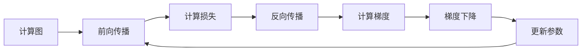

# 总结

本文系统介绍了深度学习的三个核心数学基础：计算图、反向传播和梯度下降。通过理论分析、数学推导和实际代码实现，我们展示了这些概念如何共同构成了现代深度学习的基础设施。

## 核心概念回顾

### 1. 计算图（Computational Graph）
- **定义**：将数学表达式表示为有向无环图的数据结构
- **作用**：可视化复杂表达式，为自动微分提供基础
- **关键元素**：输入节点、操作节点、输出节点、有向边
- **优势**：支持并行计算、优化计算顺序、便于调试

### 2. 反向传播（Backpropagation）
- **原理**：基于链式法则的高效梯度计算算法
- **过程**：前向传播计算值，反向传播计算梯度
- **关键公式**：$\frac{\partial L}{\partial v} = \sum_{w \in \text{children}(v)} \frac{\partial L}{\partial w} \cdot \frac{\partial w}{\partial v}$
- **实现**：现代深度学习框架的自动微分系统

### 3. 梯度下降（Gradient Descent）
- **目标**：通过迭代优化寻找函数最小值
- **更新规则**：$\theta_{t+1} = \theta_t - \eta \cdot \nabla_\theta J(\theta)$
- **变体**：批量梯度下降、随机梯度下降、小批量梯度下降
- **高级算法**：动量法、AdaGrad、RMSProp、Adam

## 三者关系

这三个概念形成了深度学习的完整训练流程：



1. **计算图**定义了模型的计算结构
2. **反向传播**通过计算图高效计算梯度
3. **梯度下降**利用梯度信息优化模型参数

## 实际应用价值

### 1. 模型开发
- 理解计算图有助于设计和调试复杂模型
- 掌握反向传播原理可以优化训练过程
- 熟悉梯度下降变体可以选择合适的优化算法

### 2. 性能优化
- 通过计算图分析可以识别计算瓶颈
- 梯度检查可以验证反向传播的正确性
- 学习率调度可以加速收敛并提高精度

### 3. 问题诊断
- 梯度消失/爆炸问题的识别和解决
- 过拟合/欠拟合的诊断和处理
- 训练不收敛的原因分析和调整

## 关键实践建议

### 1. 计算图实践
```python
# 可视化计算图
from torchviz import make_dot
dot = make_dot(output, params=dict(model.named_parameters()))
dot.render("model_graph", format="png")
```

### 2. 梯度检查
```python
# 数值梯度验证
from torch.autograd import gradcheck
test = gradcheck(func, inputs, eps=1e-6, atol=1e-4)
```

### 3. 优化器选择
- **简单问题**：SGD with momentum
- **一般问题**：Adam（默认选择）
- **特殊问题**：根据问题特性选择特定优化器

## 进一步学习路径

### 1. 理论基础深化
- **数学基础**：矩阵微积分、凸优化、数值分析
- **优化理论**：收敛性分析、优化算法理论
- **概率统计**：贝叶斯推断、统计学习理论

### 2. 算法扩展
- **二阶优化方法**：牛顿法、拟牛顿法（L-BFGS）
- **自适应优化**：AdaDelta、Nadam、AMSGrad
- **分布式优化**：异步SGD、模型并行、数据并行

### 3. 高级主题
- **元学习**：学习如何学习（Learning to Learn）
- **神经架构搜索**：自动设计神经网络结构
- **可微分编程**：将整个程序视为可微分计算图

### 4. 实践项目
1. **图像分类**：CIFAR-10/100、ImageNet
2. **自然语言处理**：文本分类、机器翻译
3. **强化学习**：游戏AI、机器人控制
4. **生成模型**：GAN、VAE、扩散模型

## 资源推荐

### 1. 经典教材
- 《Deep Learning》（Ian Goodfellow等）
- 《Pattern Recognition and Machine Learning》（Christopher Bishop）
- 《Neural Networks and Deep Learning》（Michael Nielsen）

### 2. 在线课程
- 吴恩达《深度学习专项课程》（Coursera）
- Fast.ai《实用深度学习》（fast.ai）
- 李宏毅《机器学习》（YouTube）

### 3. 开源项目
- **PyTorch Tutorials**：官方教程和示例
- **TensorFlow Examples**：丰富的实践案例
- **Hugging Face Transformers**：预训练模型库

### 4. 研究论文
- 《Learning representations by back-propagating errors》（Rumelhart等，1986）
- 《Adam: A Method for Stochastic Optimization》（Kingma & Ba，2014）
- 《Attention Is All You Need》（Vaswani等，2017）

## 行业应用前景

### 1. 计算机视觉
- 自动驾驶：目标检测、语义分割
- 医疗影像：疾病诊断、图像分析
- 安防监控：人脸识别、行为分析

### 2. 自然语言处理
- 智能助手：对话系统、语音识别
- 机器翻译：多语言翻译、实时翻译
- 文本生成：内容创作、代码生成

### 3. 科学计算
- 物理模拟：流体动力学、分子动力学
- 生物信息：蛋白质结构预测、药物发现
- 气候预测：天气模型、气候模拟

## 伦理与社会责任

在应用深度学习技术时，需要考虑以下伦理问题：

### 1. 公平性与偏见
- 确保模型不歧视任何群体
- 检测和消除训练数据中的偏见
- 建立公平性评估指标

### 2. 透明度与可解释性
- 开发可解释的AI系统
- 提供决策依据和解释
- 建立问责机制

### 3. 隐私保护
- 实施数据匿名化和加密
- 开发联邦学习等隐私保护技术
- 遵守数据保护法规（如GDPR）

### 4. 社会责任
- 考虑技术的社会影响
- 避免恶意应用和滥用
- 促进技术的普惠性

## 结语

计算图、反向传播和梯度下降构成了深度学习的数学基础，理解这些概念对于掌握深度学习至关重要。随着技术的不断发展，这些基础概念也在不断演进和扩展。

深度学习不仅是一门技术，更是一种思维方式。它教会我们如何：
- 将复杂问题分解为简单组件
- 通过迭代优化逐步改进解决方案
- 从数据中自动学习模式和规律

通过本课程的学习，希望读者不仅掌握了具体的技术知识，更重要的是培养了解决复杂问题的能力和持续学习的习惯。深度学习领域日新月异，保持好奇心和探索精神，不断学习和实践，才能在这个充满机遇的领域中取得成功。

**记住**：理论是基础，实践是关键，创新是灵魂。祝你在深度学习的旅程中不断进步，创造出有意义的成果！

```{admonition} 最后的话
:class: tip

"深度学习不是魔法，而是数学、代码和数据的艺术。理解基础原理，掌握实践技能，保持批判思维，你就能在这个激动人心的领域中创造价值。"

—— 与所有深度学习学习者共勉
```
